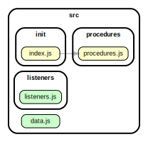

<!-- BEGIN TITLE -->

# DOCS

<!-- END TITLE -->

<!-- BEGIN TREE -->

<!-- END TREE -->

<!-- BEGIN TOC -->

- handlers
- init
  - [index.js](#srcinitindexjs)
- listeners
  - [listeners.js](#srclistenerslistenersjs)
- logic
- procedures
  - [procedures.js](#srcproceduresproceduresjs)
- [data.js](#srcdatajs)

<!-- END TOC -->

<!-- BEGIN DOCS -->

---

# /handlers

---

[TOP](#DOCS)

---

# /init

<a href="../src/init/index.js" id="srcinitindexjs">src/init/index.js</a>

---

[TOP](#DOCS)

---

# /listeners

<a href="../src/listeners/listeners.js" id="srclistenerslistenersjs">src/listeners/listeners.js</a>

---

[TOP](#DOCS)

---

# /logic

---

[TOP](#DOCS)

---

# /procedures

<a href="../src/procedures/procedures.js" id="srcproceduresproceduresjs">src/procedures/procedures.js</a>

---

[TOP](#DOCS)

<a href="../src/data.js" id="srcdatajs">src/data.js</a>

<!-- END DOCS -->
